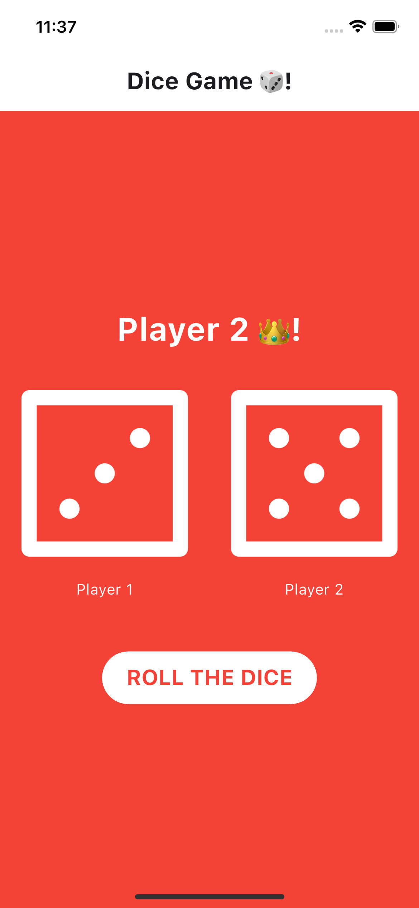
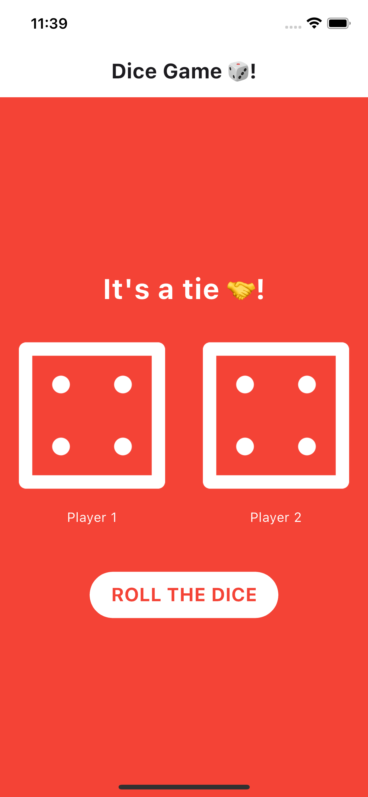
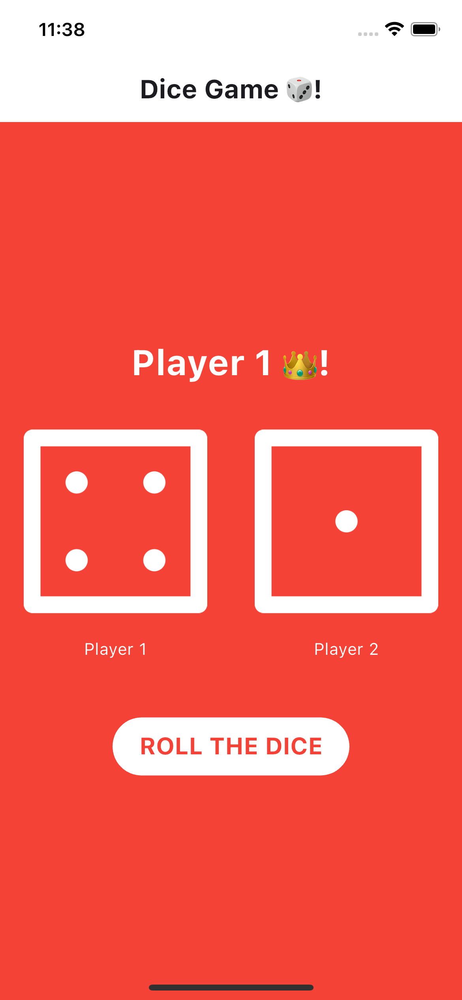

# Dice Game 🎲!

Welcome to the Dice Game, a simple Flutter application to simulate a dice rolling game between two players.

## How to Play

1. Clone or download this repository to your local machine.
2. Ensure you have Flutter installed. If not, follow the instructions on the [official Flutter website](https://flutter.dev/docs/get-started/install).
3. Navigate to the project directory in your terminal.
4. Run `flutter run` to launch the application on your device or emulator.

## Rules

- Two players take turns rolling a six-sided dice.
- The player with the highest dice roll wins the round.
- If both players roll the same number, it's a tie.

## Screenshots

## Technologies Used

- Flutter
- Dart
